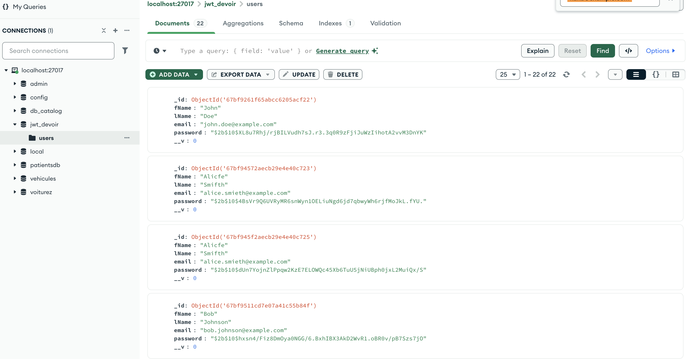
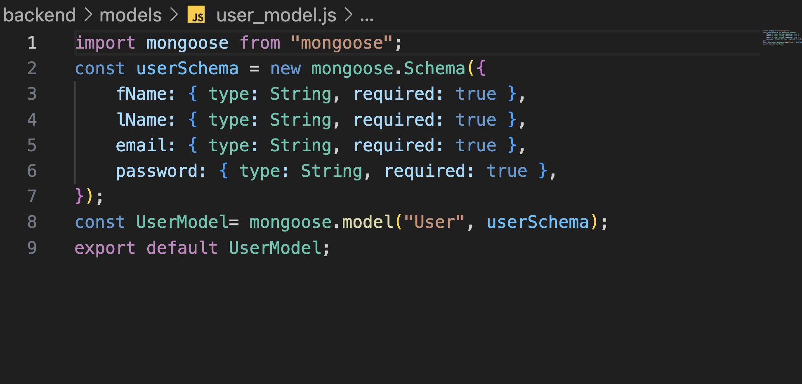
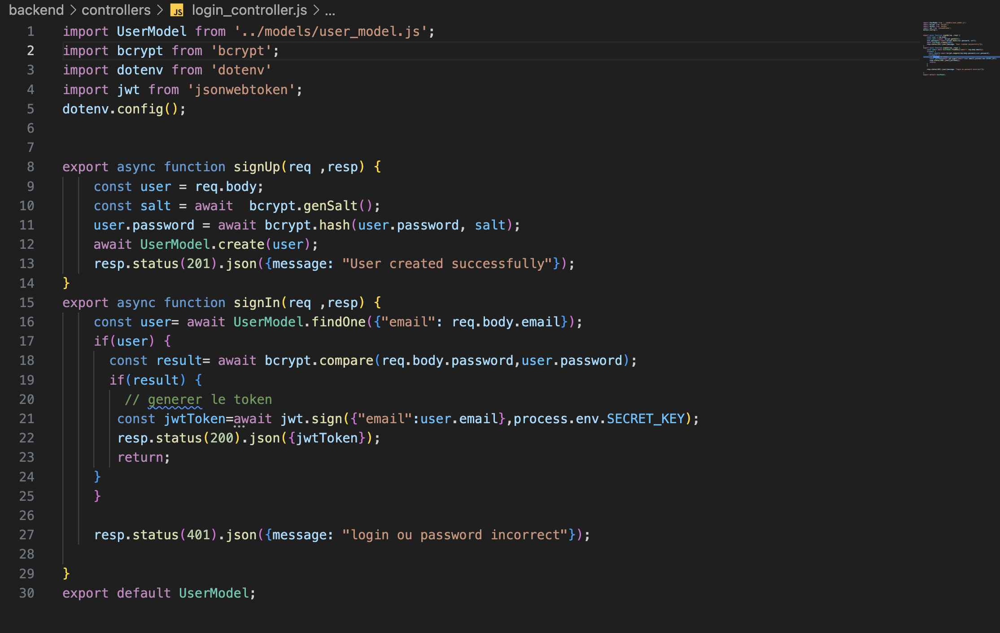
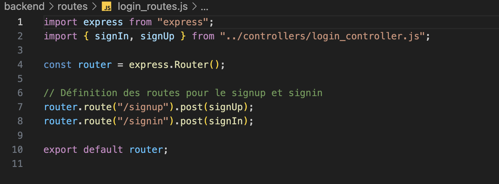
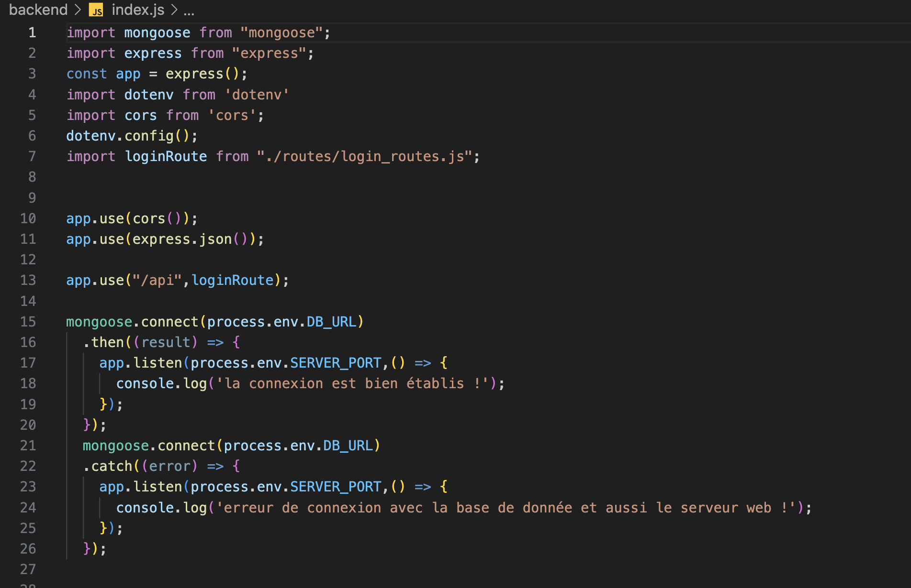
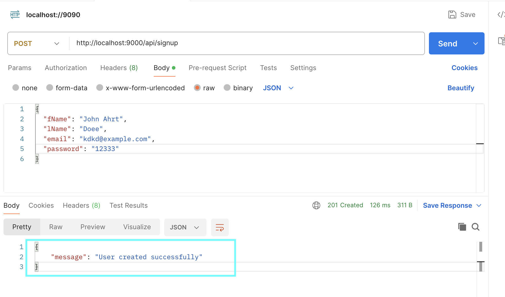
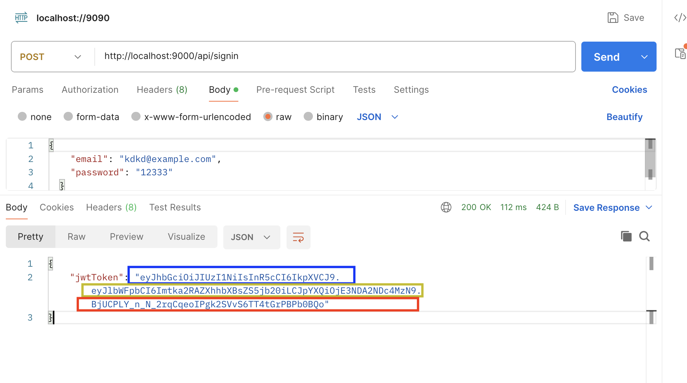

# **Projet d'Authentification avec Node.js, Express et MongoDB** 🔐

## **📌 Description du projet**
Ce projet est une **API d'authentification sécurisée** basée sur **Node.js et Express**, utilisant **MongoDB** comme base de données.  
Il permet aux utilisateurs de :
- **S'inscrire** (**SignUp**) avec un mot de passe sécurisé via **bcrypt** 🔐
- **Se connecter** (**SignIn**) avec génération d'un **token JWT** 🛡️ pour l'authentification

---

## **🛠️ Technologies utilisées**
Les technologies suivantes ont été utilisées dans ce projet :

- **Node.js** : Environnement d'exécution JavaScript
- **Express.js** : Framework web rapide et minimaliste pour Node.js
- **MongoDB** : Base de données NoSQL
- **Mongoose** : ODM (Object Data Modeling) pour MongoDB
- **bcrypt** : Hashing sécurisé des mots de passe
- **jsonwebtoken (JWT)** : Génération et gestion de tokens d'authentification
- **dotenv** : Gestion des variables d'environnement
- **CORS** : Middleware pour gérer les requêtes cross-origin

---

## **🚀 Installation et configuration**
### **1️⃣ Cloner le projet**
```bash
git clone https://github.com/MAHAMAT-AHMAT/jwt-auth-node.git
cd jwt-auth-node
```

### **2️⃣ Installer les dépendances**
```bash
npm install
```

### **3️⃣ Configurer les variables d'environnement**
Créer un fichier **`.env`** à la racine du projet et y ajouter les variables suivantes :

```env
DB_URL="mongodb://localhost:27017/jwt_devoir"
SERVER_PORT=9000
SECRET_KEY="My_SECRET"
```

### **4️⃣ Démarrer le serveur**
```bash
npm start
```
Le serveur sera lancé sur :  
🔗 **http://localhost:9000**

---

## **📂 Structure du projet**
```
/jwt-auth-node
│── /controllers
│   ├── login_controller.js
│── /models
│   ├── user_model.js
│── /routes
│   ├── login_routes.js
│── /screenshots   <-- 📸 Captures d'execution
│── .env
│── package.json
│── README.md
```

---

## **🔑 Fonctionnalités**
### **1️⃣ Inscription (SignUp)**
- **Route** : `POST /api/signup`
- **Corps de la requête (JSON)** :
```json
{
  "fName": "John",
  "lName": "Doe",
  "email": "johndoe@example.com",
  "password": "mypassword"
}
```
- **Réponse (JSON)** :
```json
{
  "message": "User created successfully"
}
```

### **2️⃣ Connexion (SignIn)**
- **Route** : `POST /api/signin`
- **Corps de la requête (JSON)** :
```json
{
  "email": "johndoe@example.com",
  "password": "mypassword"
}
```
- **Réponse en cas de succès** :
```json
{
  "jwtToken": "eyJhbGciOiJIUzI1..."
}
```
- **Réponse en cas d'échec** :
```json
{
  "message": "login ou password incorrect"
}
```

---

## **🛠 Base de données**
Voici un aperçu des utilisateurs enregistrés dans MongoDB :


---
## 🚀 Code du backend

|  |  |  |  |
|:------------------------------------------------:|:----------------------------------------------:|:--------------------------------------:|:---------------------------------:|
| **Modèle utilisateur**                           | **Contrôleur**                                 | **Routes**                             | **Index.js**                      |

---
## 🔑 Authentification

|  |  |
|:---------------------------------------------------------:|:-----------------------------------------------------:|
| **Inscription réussie**                                   | **Connexion réussie**                                 |

---
## **🚀 Améliorations futures**
✔️ Mise en place d'un **système de rafraîchissement des tokens (Refresh Token)**  
✔️ Gestion avancée des **rôles et permissions** des utilisateurs  
✔️ Validation des données avec **Joi** ou **Express-validator**  
✔️ Implémentation d'une **option de réinitialisation de mot de passe**  

---

## **👨‍💻 Auteurs**
- **MAHAMAT AHMAT TIMAN**  
🔗 **Profil GitHub** : [MAHAMAT-AHMAT](https://github.com/MAHAMAT-AHMAT/jwt-auth-node)

---

## **📜 Licence**
Ce projet est sous **licence MIT**. Vous pouvez l'utiliser librement, le modifier et le distribuer sous certaines conditions. 

---

### ✅ **Pourquoi cette structuration est meilleure ?**
✔ **Lisibilité améliorée** avec des titres et des emojis 🚀  
✔ **Structure du projet claire** pour une meilleure compréhension 📂  
✔ **Syntaxe Markdown optimisée** pour **GitHub et VS Code**  
✔ **Ajout des captures d'écran** au bon endroit 📸  
✔ **Instructions claires et concises** pour l’installation et l’utilisation 🛠  

---

